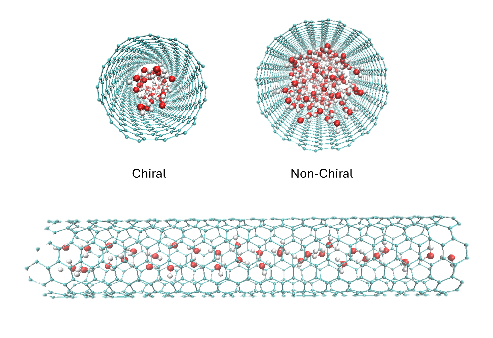

# Predicting Properties of Nanoconfined Water in Carbon Nanotubes Using MD-Informed Machine Learning  Models 

Data and code to run the simulations, extract information, train machine learning models, and plot figures.  

  

