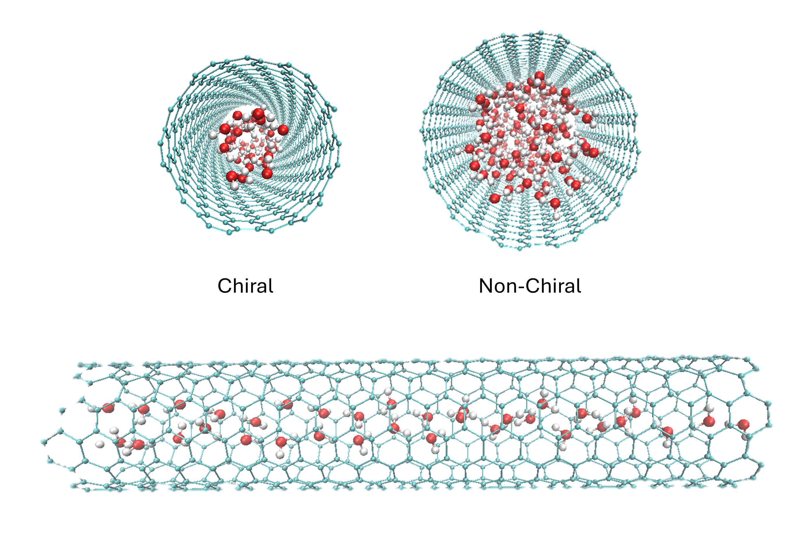

# Predicting Properties of Nanoconfined Water in Carbon Nanotubes Using MD-Informed Machine Learning Models

Supporting data and code for the publication. This repository contains everything needed to reproduce the work: GROMACS molecular dynamics (MD) simulations of water confined in single-walled carbon nanotubes (CNTs), analysis of the simulation trajectories, machine learning models trained on the MD results, and the experimental neutron scattering and characterization data used for validation.

<p align="center">
  
</p>

## Repository Structure

```
├── Data/                       # Experimental and processed data
│   ├── input_data.csv          # ML training set from MD: CNT diameter, chirality, and
│   │                           # temperature vs. diffusion coefficient, H-bonds, and phase
│   ├── Adsorption/             # Adsorption isotherm and BJH pore-size data for chiral
│   │                           # and non-chiral CNT samples (.xlsx)
│   ├── ORNL/                   # Neutron scattering data from the BASIS backscattering
│   │   │                       # spectrometer (SNS, Oak Ridge National Laboratory)
│   │   ├── Processed_Data/     # Elastic scans and QENS spectra for each sample:
│   │   │                       # 0.84 nm CNT (hydrated), (6,5) CNT (dry and hydrated)
│   │   └── SOD_data/           # Reduced BASIS .dat files for each sample
│   ├── SANS/                   # Merged EQ-SANS small-angle scattering curves (.txt)
│   └── SEM/                    # SEM images of open- and closed-end CNTs (.tif)
│
├── Notebooks/                  # Analysis and plotting notebooks (see below)
│
├── Run Simulations/            # GROMACS simulation inputs and run notebooks
│   ├── Simulation Run/         # Single-simulation setup: CNT structures (.gro),
│   │                           # OPLS-AA force field, .mdp parameter files,
│   │                           # build_cnt_itp.py topology builder, and a notebook
│   │                           # that runs minimization → NVT → production
│   └── Simulation Run HT/      # High-throughput version: sweeps CNT chiralities (n,m)
│                               # using pre-built CNT .gro files at several tube lengths
│
├── Figures/                    # Generated figures and fitted-model outputs (per-sample
│                               # diffusion fits as .csv alongside the .png plots)
│
├── environment.yml             # Conda environment for all analysis notebooks
└── LICENSE                     # MIT license
```

## Notebooks

| Notebook | Purpose |
|---|---|
| `Run Simulations/.../Run Simulation.ipynb` | Builds the system and runs the GROMACS simulations (energy minimization, equilibration, production NVT). The HT version loops over CNT chiralities for the high-throughput dataset. |
| `Notebooks/Process MD Simulation Data.ipynb` | Analyzes MD trajectories: diffusion coefficient of confined water (MSD), average hydrogen bonds per confined molecule, radial density profiles, and the van Hove self-correlation function. Produces `Data/input_data.csv`. |
| `Notebooks/Fit ML and Plotting.ipynb` | Trains the machine learning models on the MD-derived dataset and generates the main figures (diffusion, radial density profiles, hydrogen bonding). |
| `Notebooks/QENS Data Processing.ipynb` | Fits the quasi-elastic neutron scattering spectra and extracts experimental diffusion constants for comparison with simulation. |
| `Notebooks/SANS Data.ipynb` | Plots the EQ-SANS small-angle neutron scattering data. |
| `Notebooks/Adsorption Data.ipynb` | Plots the adsorption isotherm and pore-size distribution data. |
| `Notebooks/Supplemental Info.ipynb` | Supplementary analyses, including the modified MSD calculation restricted to confined water. |

## Getting Started

1. Create the conda environment for the analysis notebooks:

   ```bash
   conda env create -f environment.yml
   conda activate MSD_simulations
   ```

2. (Optional, only to rerun simulations) Install [GROMACS](https://www.gromacs.org/). The simulation notebooks in `Run Simulations/` call GROMACS from the command line; the OPLS-AA force field and all input files (`.gro`, `.itp`, `.mdp`, `.top`) are included in the `Template/` folders.

3. To reproduce the analysis without rerunning the MD simulations, start from `Notebooks/Fit ML and Plotting.ipynb`, which trains the ML models directly on the included `Data/input_data.csv`.

## Workflow

1. **Simulate** — `Run Simulations/` builds water-filled CNTs of varying diameter and chirality and runs NVT MD across temperatures.
2. **Extract** — `Process MD Simulation Data.ipynb` computes diffusion coefficients, hydrogen-bond counts, and density profiles from the trajectories.
3. **Learn** — `Fit ML and Plotting.ipynb` trains ML models to predict confined-water properties from CNT diameter, chirality, and temperature.
4. **Validate** — `QENS Data Processing.ipynb`, `SANS Data.ipynb`, and `Adsorption Data.ipynb` process the experimental data (BASIS QENS/elastic scans, EQ-SANS, adsorption) used to validate the simulations.

## Experimental Data

Neutron scattering experiments were performed at the Spallation Neutron Source, Oak Ridge National Laboratory: quasi-elastic and elastic neutron scattering on the BASIS backscattering spectrometer and small-angle scattering on EQ-SANS. Samples include hydrated and dry CNTs of two diameters (a (6,5) chiral CNT and a 0.84 nm CNT). Adsorption isotherms and SEM images characterize the CNT samples.

## License

This project is released under the [MIT License](LICENSE).

